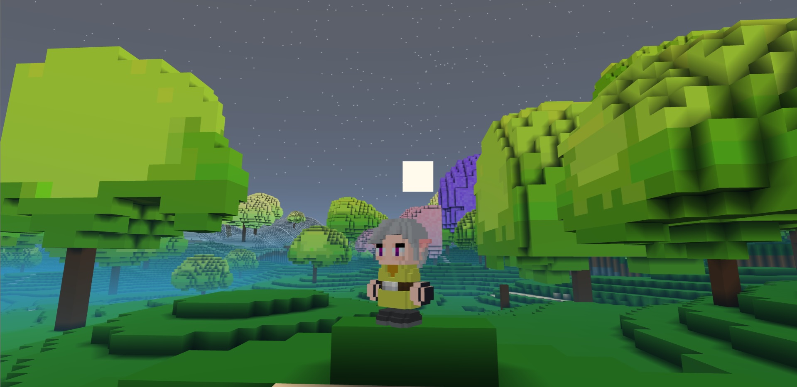
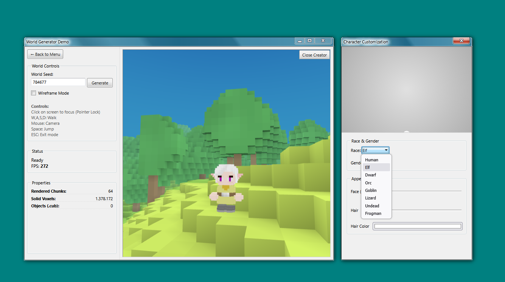
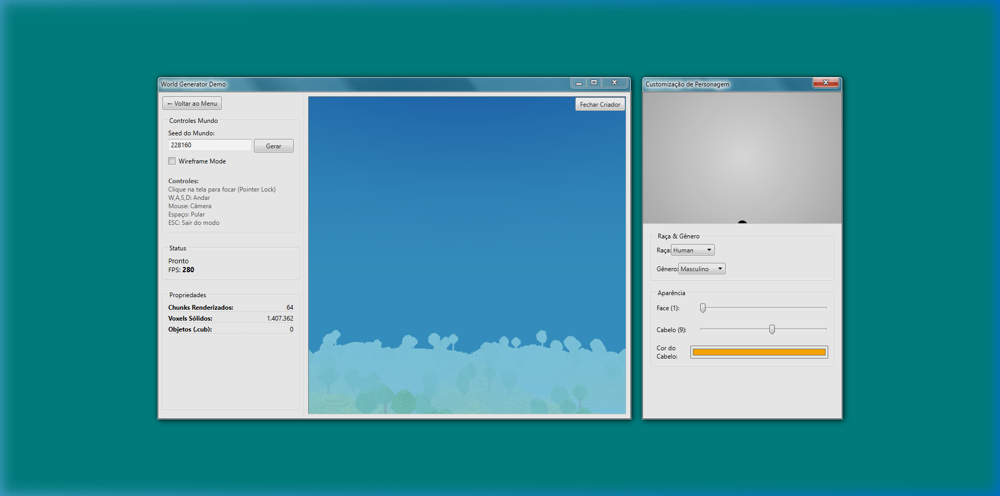

# CubWrdThreeJs

CubWrdThreeJs is an open-source web-based parser and rendering engine for Cube World Alpha (.cub) voxel models, built with React and Three.js. It features a fully functional Character Creator replicating the original game's appearance system, a World Generator for rendering procedurally generated voxel terrains, and a standalone `.cub` file viewer.

# CubWrdThreeJs

Test it online now!


https://cub-wrld-js.vercel.app/

## Screenshots

### Character Creator


### Model Viewer


## Features

- **Character Creator**: Customize race, gender, face, hair, and hair color. Replicates the original Cube World vertex coloring logic, including proper handling of embedded attachment points and z-fighting mitigation.
- **World Generation**: Procedural voxel terrain generation with biome rendering and decoration placement (trees, bushes, flowers).
- **.cub Voxel Parser**: Parses original Cube World `.cub` files, mapping standard RGB values into Three.js geometries while applying proper Face Shading (CUB_SHADE).
- **Optimized Rendering**: Leverages `THREE.MeshBasicMaterial` with vertex colors for high-performance flat shading that matches the original game's aesthetic.
- **Internationalization (i18n)**: Fully translatable UI strings centralized in `src/i18n.js`.

## Tech Stack

- **Framework**: React 18
- **3D Engine**: Three.js
- **Build Tool**: Vite
- **Styling**: Vanilla CSS

## Getting Started

### Prerequisites
- Node.js (v16 or higher recommended)
- npm or yarn

### Installation

1. Clone the repository
   ```bash
   git clone https://github.com/yourusername/CubWrdThreeJs.git
   cd CubWrdThreeJs
   ```

2. Install dependencies
   ```bash
   npm install
   ```

3. Start the development server
   ```bash
   npm run dev
   ```

4. Open your browser at `http://localhost:5173`.

## Architecture Notes

The `.cub` parser extracts binary volume data and builds optimized buffer geometries by culling interior faces. The character compositor fetches individual components (head, body, hands, feet, hair) and properly computes dynamic vertex tinting based on grayscale extraction for hair colors, and base color anchoring for skin tones.

## License

This project is licensed under the MIT License.
